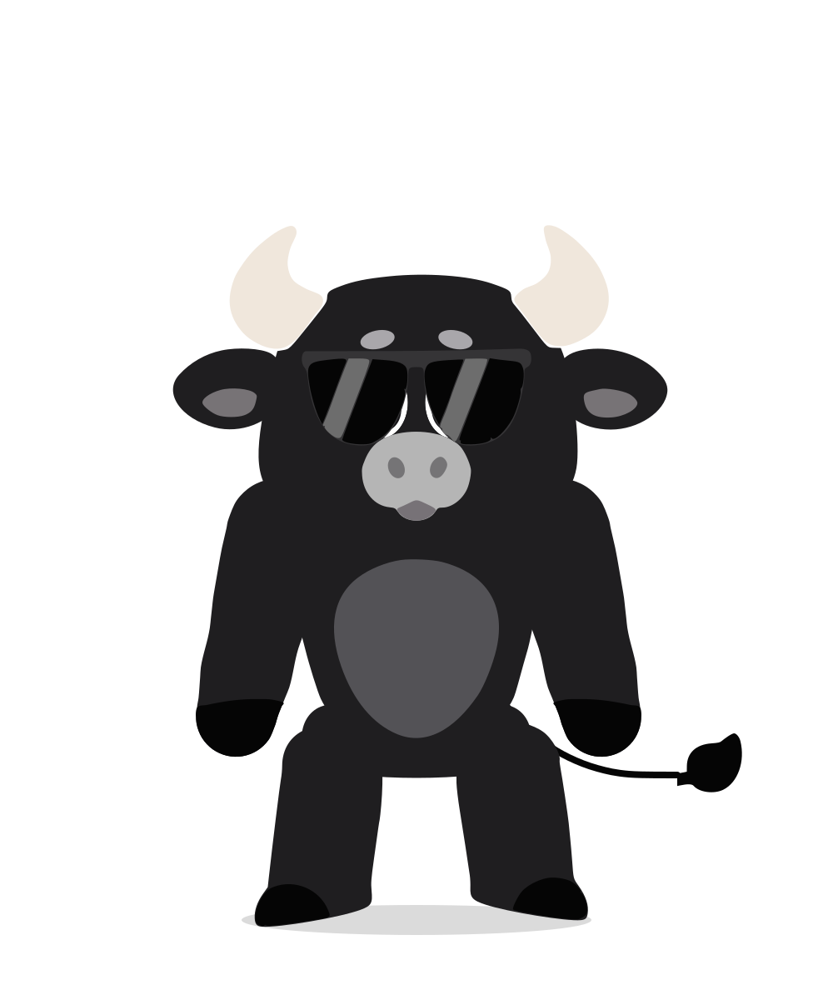

# Kabi — an open-source Rive mascot for workout apps

<p align="center"></p>

Kabi is a friendly bull mascot for fitness apps: a vector, bone-rigged [Rive](https://rive.app) character with 29 workout poses, 8 moods, 8 body colors, gaze tracking and a head-only avatar mode, all driven by a single state machine. There's also a web viewer and a rig/animation editor.

The `.riv` file is **generated from code**. The artwork is traced from `reference.jpeg`, and the rig, animations and state machine are defined in JavaScript and compiled straight to Rive's binary format. No Rive editor is needed.

**Just want the mascot?** Download [`dist/kabi.riv`](dist/kabi.riv) and drop it into any Rive runtime (web, iOS, Android, Flutter, React). The inputs are documented [below](#state-machine-kabi).

## Quick start

Requires Node.js 18+.

```bash
npm install
npm run dev        # builds dist/ and serves http://localhost:5173/web/
```

- **Viewer**: `http://localhost:5173/web/`. Workout "moments", every pose, mood, trigger and toggle, eyes that follow the cursor, tap to poke, and integration snippets.
- **Pose lab**: `http://localhost:5173/web/lab.html?cells=thinking:happy,idle:head:outline&bg=111111`. Renders several configurations side by side (`pose[:mood][:glassesoff][:head][:outline][:trigger!]`); `rect=` / `headRect=` outline a crop region.
- **Editor**: `http://localhost:5173/web/editor.html`. Pose bones by dragging them, edit keyframes on a timeline, change the rest pose and palette, test the state machine live, and export `.riv`, model JSON or SVG.

## What's in `dist/`

| File | What it is |
| --- | --- |
| `kabi.riv` | The Rive runtime file (about 240 KB). Artboard `Kabi` 1000×1200, state machine `Kabi`. |
| `kabi.model.json` | Editable source model. The editor imports and exports this format. |
| `kabi.svg` | Rest pose as flat vectors, for Figma or the Rive editor. |

## Rig

There are 41 Rive bones and 36 group nodes:

- **Spine:** 3 bones
- **Neck:** 2 bones
- **Shoulders:** a clavicle bone each, which carries the arm, anchors the top of the arm to the torso and lets the shoulders shrug
- **Arms:** 5 bones each (upper arm and forearm split in two, plus the wrist), plus a bicep bone inside each upper arm
- **Legs:** 5 bones each (thigh and shin split in two, plus the foot)
- **Tail:** 8 bones
- **Ears:** 2 bones each

The torso, belly, arms, hooves, legs, ears and tail are each one vector path **skinned** to their bone chain, so they bend in smooth curves instead of hinging. The arms are drawn procedurally rather than traced: a chunky, tapered limb (round shoulder, slightly slimmer elbow) sampled every ~12 px along its length. The black hoof-hand is the tip of that same outline past a slanted cuff line, so it always stays flush with the arm. That dense outline, soft skin weights and an elbow cap let the arms bend in smooth, rubbery curves in any direction. The legs use tighter weights and knee caps. The head is layered on top of the arms. Each upper arm contains a bicep bone: flexing scales it, which swells the arm's own outline into a bicep in flex, curls, ready, celebrate and jump. Skin weights are computed automatically from the bind pose each time the file is compiled. Pose helpers spread a spine or neck bend across all their bones, keep the feet flat on the ground, and let the wrists and ear tips trail slightly behind the rest of the motion.

```
root ─ body ─┬─ tail ─ ●tail1 … ●tail8 ─ tailTip (tuft)
             ├─ legL/R ─ ●thigh ●thighB ●shin ●shinB ●foot                     (pelvis joins legs to torso)
             └─ chest ─ ●spine1 ●spine2 ●spine3 ─┬─ ●neck1 ●neck2 ─ head ─┬─ earL/R ─ ●ear1 ●ear2
                                                 │                        └─ horns, face (tall oval eyes, oval brows, muzzle, mouths, glasses)
                                                 └─ ●clavicleL/R ─ armL/R ─ ●upperArm (●bicep) ●upperArmB ●forearm (elbow cap) ●forearmB ●wrist ─ hand ─ dumbbell
```

### Motion

- **Smooth bends:** every elbow and knee bend is spread over three joints (25% / 50% / 25%), so limbs curve in an arc instead of kinking at a single hinge.
- **Follow-through:** in every pose and one-shot, the shoulders, forearms, wrists, biceps, neck and head lag the body slightly. The build adds this automatically and keeps the loops seamless.
- **Transitions:** switching between poses, moods, glasses and one-shots crossfades with easing (about 0.5 s between poses) instead of a linear blend.

## State machine `Kabi`

| Input | Type | Values |
| --- | --- | --- |
| `pose` | number | 0 idle · 1 wave · 2 flex · 3 squat (barbell) · 4 jumpingJacks · 5 run · 6 curls · 7 celebrate · 8 tired · 9 sleep · 10 stretch · 11 ready · 12 pushup · 13 plank · 14 lunge · 15 burpee · 16 boxing · 17 jumpRope · 18 highKnees · 19 thinking · 20 shrug · 21 presentLeft · 22 presentRight · 23 handsOnHips · 24 clap · 25 heart (hand on heart) · 26 listen (hand to ear) · 27 fistPump · 28 crossedArms |
| `mood` | number | 0 neutral · 1 happy · 2 determined · 3 tired · 4 sad · 5 surprised · 6 sleepy · 7 proud |
| `color` | number | body color: 0 black · 1 blue · 2 red · 3 pink · 4 green · 5 purple · 6 orange · 7 brown |
| `outline` | bool | light rim around the silhouette, for dark backgrounds |
| `headOnly` | bool | show just the head, zoomed to fill the frame (avatars, chat bubbles, notifications) |
| `glasses` | bool | sunglasses on, or taken off |
| `shirt` | bool | black T-shirt with a small gray bull-head logo on the chest |
| `lookX` / `lookY` | number | −100…100 gaze (1D blend states) |
| `jump`, `hi`, `poke` | trigger | one-shots that return to the current pose |

The state machine has eleven layers that run at the same time:

- **Body** (poses and one-shots)
- **Ambient** (tail swish and ear flicks)
- **Blink**
- **Face** (moods, plus a surprised flash on `poke`)
- **Glasses**
- **Shirt** (`shirt`: fades the T-shirt and sleeves in or out)
- **Color** (recolors the body and belly, blending over 350 ms)
- **View** (`headOnly`: fades out everything below the neck and zooms onto the head)
- **Outline** (`outline`: fades in a stroked copy of each silhouette part, drawn behind all fills)
- **LookX**
- **LookY**

A pose, a mood and the gear toggles can be combined freely.

```js
import { Rive } from '@rive-app/canvas';
const kabi = new Rive({ src: 'kabi.riv', canvas, stateMachines: 'Kabi', autoplay: true, onLoad() {
  const i = Object.fromEntries(kabi.stateMachineInputs('Kabi').map((x) => [x.name, x]));
  i.pose.value = 7; i.mood.value = 1; i.color.value = 3; i.jump.fire();   // pink, "New PR!"
}});
```

The viewer has React, SwiftUI, Android and Flutter snippets.

## How it's built

There's no Rive editor in this pipeline. The `.riv` is written directly from code.

1. `tools/trace.mjs` segments `reference.jpeg` by color, then vectorizes each part with potrace into `src/character/traced.js`.
2. `src/character/rig.js` places the parts, builds the bones, draws the arms procedurally and adds the extra art: eyes, brows, mouths, the T-shirt and its logo, dumbbells, sweat, Zzz and sparkles.
3. `src/character/animations.js` defines the poses. Limbs are posed by screen angle and converted to bone rotations.
4. `src/character/index.js` assembles the model and the state machine. Every animation in a layer is padded so that switching states never leaves stale values behind.
5. `src/riv/compile.js` and `src/riv/writer.js` encode the model in Rive's binary runtime format (v7). The type and property keys come from `rive-runtime`'s generated headers.

`npm run build -- --model path/to/edited.json` compiles a model exported from the editor.

### Notes

- The file loads and plays in the official Rive web runtime (`@rive-app/canvas` 2.43, copied into `web/vendor` by `npm run build`). It uses only long-standing core objects (nodes, bones, skins, paths, keyframes, cubic easing, state machine layers, blend states), so it should also load in the iOS, Android and Flutter runtimes. It hasn't been tested on devices yet.
- The Rive editor can't open `.riv` files as editable projects. To keep working in Rive's own editor, import `dist/kabi.svg` and re-rig it there. Otherwise, keep editing here and re-export.
- The editor autosaves to your browser's local storage. **Reset** rebuilds the model from source.

## Project layout

```
reference.jpeg          source artwork the vectors are traced from
assets/                 T-shirt logo (logo.png source, logo.svg traced by tools/trace-logo.mjs)
src/character/          the mascot: traced art, rig, animations, state machine
src/riv/                model -> .riv compiler (binary writer, skinning, SVG export)
tools/                  build, trace and dev-server scripts
web/                    viewer (index.html), editor (editor.html), pose lab (lab.html)
dist/                   built outputs: kabi.riv, kabi.model.json, kabi.svg
```

## Contributing

Issues and pull requests are welcome. Run `npm run build` before committing so `dist/` stays in sync with the source. Poses live in `src/character/animations.js`; see the helpers at the top of that file (`arms`, `legs`, `spine`, …), which take screen angles.

## License

Kabi (the artwork, the generated Rive files, the source code and the docs) is licensed under **[Creative Commons Attribution 4.0 International (CC BY 4.0)](LICENSE)**. You're free to use, adapt and ship it, including commercially, as long as you give credit, for example:

> Kabi mascot by [Bryl Lim](https://github.com/bryllim/kabi-mascot), licensed under CC BY 4.0.

The Rive web runtime (`@rive-app/canvas`) is a third-party dependency under its own MIT license. It's installed from npm, not included in this repository.

